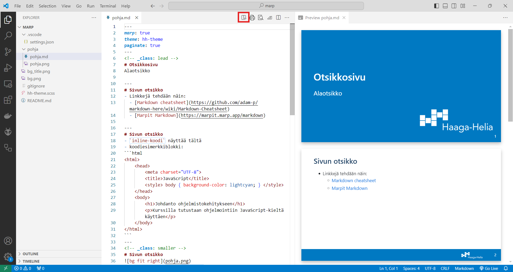

# Haaga-Helian Marp-starter

Tämä on pohjarepositorio Haaga-Helian esityspohjien mukaisten esitysten laatimiseen Markdown-kielellä Visual Studio Code -editorin _Marp for VS Code_ -lisäosalla.

Lisäosa osaa tuottaa lähdekoodista esityksen PowerPoint, PDF ja HTML-muodoissa. 

Lähdekoodi on tekstiä, joten sitä voidaan tuottaa vaivattomasti tekstieditorilla, ja sen versioita voidaan hallita kuten ohjelmakoodia. 

## Aloitus

1. Asenna Visual Studio Code -editoriin lisäosa [Marp for VS Code](https://github.com/marp-team/marp-vscode#readme)
2. Kloonaa tämä starter-repositorio itsellesi
3. Avaa repositorion juurihakemisto VSCodeen
4. Avaa tiedosto pohja.md ja editorin Markdown-esikatselu

## Materiaalien tuottaminen

Esityksiä laaditaan Markdown-kielellä:
- Markdown-syntaksi lyhyesti: [Markdown cheatsheet](https://github.com/adam-p/markdown-here/wiki/Markdown-Cheatsheet)
- Marpit-kehyksen laajennukset: [Marpit Markdown](https://marpit.marp.app/markdown)

Haaga-Helia-tyylittelyt on tehty määrittelemällä Marp-teeman päälle omia tyylejä. Jos sopivia tyylejä ei ole, niitä voi lisätä `hh-theme.scss`-tiedostoon. Mallia voi ottaa Marp-teeman lähdekoodista. 

Esitykset tuotetaan VSCodessa komennolla _Export Slide Deck_. Ohjeet Marp-lisäosan käytöstä löytyvät [lisäosan omasta dokumentaatiosta](https://github.com/marp-team/marp-vscode#readme).  

