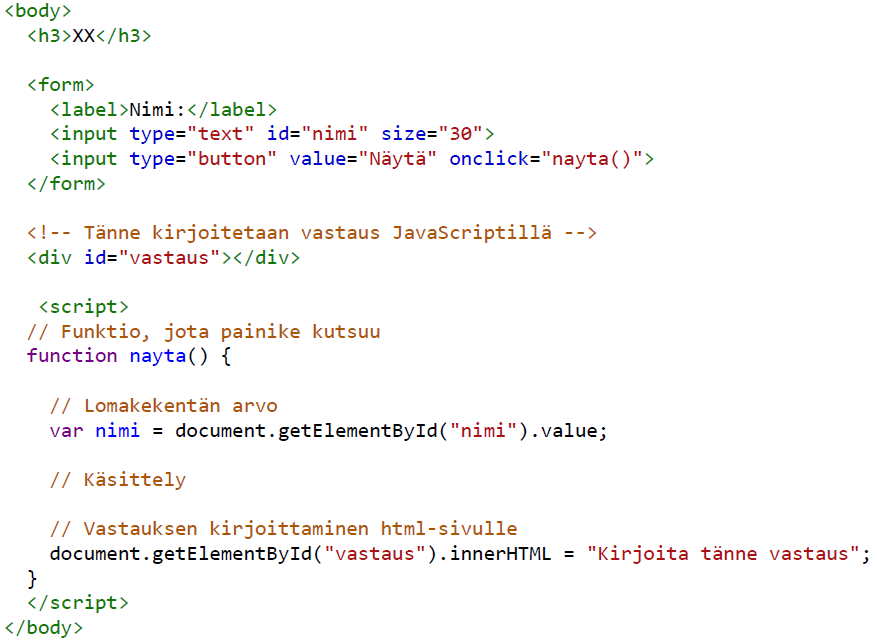

<!-- _class: lead -->
# Otsikkosivu
Alaotsikko

---
# Sivun otsikko
- Linkkejä tehdään näin: 
  - [Markdown cheatsheet](https://github.com/adam-p/markdown-here/wiki/Markdown-Cheatsheet)
  - [Marpit Markdown](https://marpit.marp.app/markdown) 

---
# Sivun otsikko
- `inline-koodi` näyttää tältä
- koodiesimerkkiblokki:
```html
<html>
    <head>
        <meta charset="UTF-8">
        <title>JavaScript</title>
        <style> body { background-color: lightcyan; } </style>
    </head>
    <body>
        <h1>Johdanto ohjelmistokehitykseen</h1>
        <p>Kurssilla tutustaan ohjelmointiin JavaScript-kieltä käyttäen</p>
    </body>
</html>
```
---
<!-- _class: smaller -->
# Sivun otsikko 

- class-määrityksellä `smaller` mahdutat sivulle enemmän tekstiä
- Näin saat kuvan ja tekstin rinnakkain

---
<!-- _class: smallest -->
# Sivun otsikko 

- class-määrityksellä `smallest` mahdutat sivulle vieläkin enemmän tekstiä
- Tiedostoon `hh-theme.scss` voit määritellä omia tyylejä 

 _Lorem ipsum dolor sit amet, consectetur adipiscing elit. Vivamus quis enim justo. Nunc vitae orci et ex condimentum dignissim. Vestibulum ante ipsum primis in faucibus orci luctus et ultrices posuere cubilia curae; Vivamus ante diam, faucibus quis sapien ac, consequat dignissim ante. Sed vehicula ante in mi varius ullamcorper. Curabitur porttitor blandit justo non cursus. Maecenas sagittis cursus lobortis. Sed dictum sit amet quam convallis consequat. Sed magna libero, malesuada non pulvinar id, eleifend ac diam. Donec tellus nunc, interdum in augue id, blandit condimentum augue. Vestibulum risus est, condimentum at fringilla a, scelerisque id libero. Fusce sed fringilla ipsum. Quisque quis dignissim nulla. Curabitur commodo ornare porttitor. Praesent vitae nisl nunc._